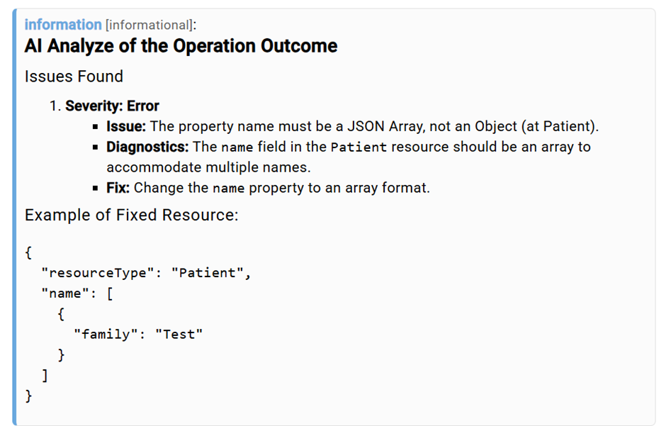
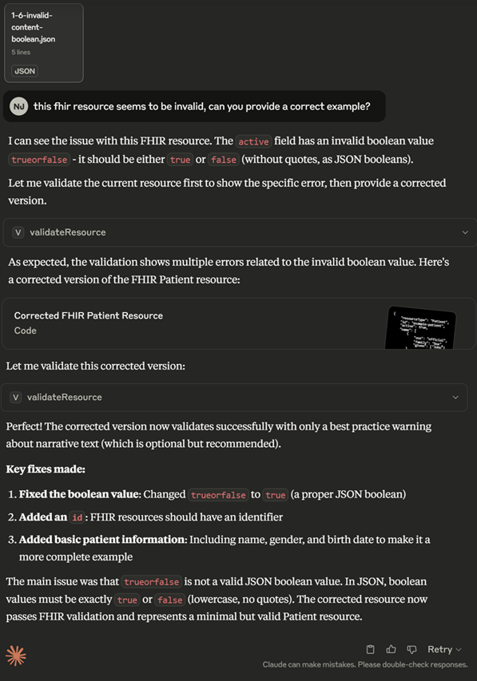

# Tutorial: Validation with AI

## Introduction
This tutorial shows how matchbox’s AI supported FHIR-Resource Validation can be used.

Combining FHIR validation with AI technologies is an opportunity to make the process more efficient and more accessible for non-specialists. Validation results for complex resources can be overwhelming to understand, therefore having AI analyze the outcome messages can be an efficient way of finding and understanding mistakes in the implementation of the resource and getting recommendations on how to fix it. 

Matchbox offers two methods of validating with support by AI technologies. 

## Analyze Outcomes with AI in matchbox

### Getting Started

To use AI analysis in matchbox the following parameters must be set when setting up the matchbox-server application properties: 

|   |   |
|---|---|
|`matchbox.fhir.context.llm.provider`| The LLM provider used for the AI analysis of validation. |
| `matchbox.fhir.context.llm.modelName` | The LLM model used for the AI analysis of validation. |
| `matchbox.fhir.context.llm.apiKey` | Your API key for the desired LLM provider. |

In addition to these parameters, the default behavior for the analysis can be decided by setting one of these parameters:

|   |   |
|---|---|
|`matchbox.fhir.context.analyzeOutcomeWithAI`| Whether the validation outcome should be analyzed by a LLM or not. Requires the LLM parameters to be correctly set. |
| `matchbox.fhir.context.analyzeOutcomeWithAIOnError` | Whether the validation outcome should be analyzed by a LLM, when it includes error or fatal issues, or not. Requires the LLM parameters to be correctly set. |

These parameters can be overridden at runtime during specific validations to adjust the behaviour for specific use cases.
Example configuration (API-Key must be replaced):

```yaml
matchbox:
  fhir:
    context:
      xVersion: true
      onlyOneEngine: true
      txServer: http://tx.fhir.org
      analyzeOutcomeWithAIOnError: true
      llm:
        provider: openai
        modelName: gpt-4o-mini
        apiKey: sk-xxx

```

### Validating Resources in matchbox

Having set up the matchbox server in this way resources can be validated as usual in matchbox ([see Tutorial: validation](validation-tutorial.md)). The validation results will now additionally include an analysis by the LLM.

In the matchbox UI it will be displayed as the top message returned by the validation:


When using the APIs $validate operation the AI analysis will appear as an additional item in the issues list. The text is returned in markdown format for clearer readability when interpreting it. 

Example:
```json
{
      "extension": [
        {
          "url": "http://hl7.org/fhir/StructureDefinition/rendering-style",
          "valueString": "markdown"
        }
      ],
      "severity": "information",
      "code": "informational",
      "details": {
        "text": "AI Analyze of the Operation Outcome"
      },
      "diagnostics": "```markdown\nThe resource has issues labeled as 'error':\n\n1. **Issue**: The property name must be a JSON Array, not an Object (at Patient).\n   - **Severity**: error\n   - **Expression**: Patient.name\n\n### Guidance:\nThe `name` property of the Patient resource should be represented as an array of objects, even if there is only one name entry. \n\n### Example Fix:\nChange your resource to the following format:\n\n```json\n{\n\t\"resourceType\": \"Patient\",\n\t\"name\": [\n\t\t{\n\t\t\t\"family\": \"Test\"\n\t\t}\n\t]\n}\n```\n\nThis will ensure the `name` field adheres to the FHIR specification.\n```"
    }
```

## Using an MCP-Client to perform validations

Matchbox provides an MCP-Server, that can be interpreted by MCP-Client Applications, such as Claude Desktop or VS Codes Github Copilot integration. This allows these applications to use the validation tool from matchbox and provide the user with clear information about the resource and interactive troubleshooting.

### Getting Started

To enable MCP capabilities for matchbox add the following configuration to the application.yaml:

```yaml
spring:
  ai:
    mcp:
      server:
        enabled: true
```

The MCP-Server can be reached at the endpoint `http://<<your-url>>/matchbox/mcp/sse`

### Setting up matchbox for Claude Desktop

For Claude Pro/Max users, follow the instructions for setting up remote MCP-Servers by [Anthropic](https://support.anthropic.com/en/articles/11175166-about-custom-integrations-using-remote-mcp).

For Free users connecting to remote servers is currently not officially supported by Anthropic. However, there are possible workarounds, such as using the [MCPHub Gateway project](https://github.com/lightconetech/mcp-gateway).

Example Claude Desktop:


### Setting up matchbox for VS Code GitHub Copilot

First, make sure the `chat.mcp.enabled` setting in VS Code is enabled.

To access the validation tool in the GitHub Copilot integration for VS Code find the settings.json file located here: `%APPDATA%\Roaming\Code\User`.

Add matchbox as MCP-Server as such:

```json
{
    //...
    "mcp": {
        "servers": {
            "matchbox": {
                "url": "http://<<your-url>>/matchbox/mcp/sse"
            }
        }
    },
    //...
}

```

Restart VS Code and within the Copilot integration select Agent mode.


 
Select the Tools button to view the available tools.
 


For further information view: [https://code.visualstudio.com/docs/copilot/chat/mcp-servers](https://code.visualstudio.com/docs/copilot/chat/mcp-servers).

Example GitHub Copilot in VS Code:

